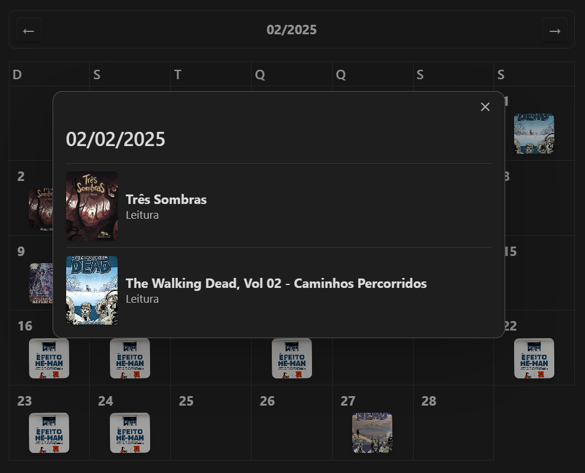

# 📅 Calendar View Plugin
<div align="right" style="float: right; margin-left: 1rem; margin-bottom: 1rem;">
  
</div>

Add a visual, interactive calendar to your notes — with daily thumbnails for any file that references that date.


## 🔧 Configuration
Set up the plugin by specifying:
- A frontmatter field to be used as the **title** of each note.
- A frontmatter field for the **thumbnail image**.
- One or more frontmatter fields containing **dates**.  
  - _Dates can be a single value or a list in the format `yyyy-MM-dd`._


## 🛠️ Usage
To embed the calendar in any note, add the following code block:

````markdown
```calendar-view
```
````

## 📆 Behavior
The calendar starts on the current month and lets you navigate freely between months.
Each day displays thumbnails of notes linked to that specific date via frontmatter fields.

Clicking a thumbnail opens a popup showing all notes associated with that day.  
Each item is clickable, opening the corresponding note in a new tab.
